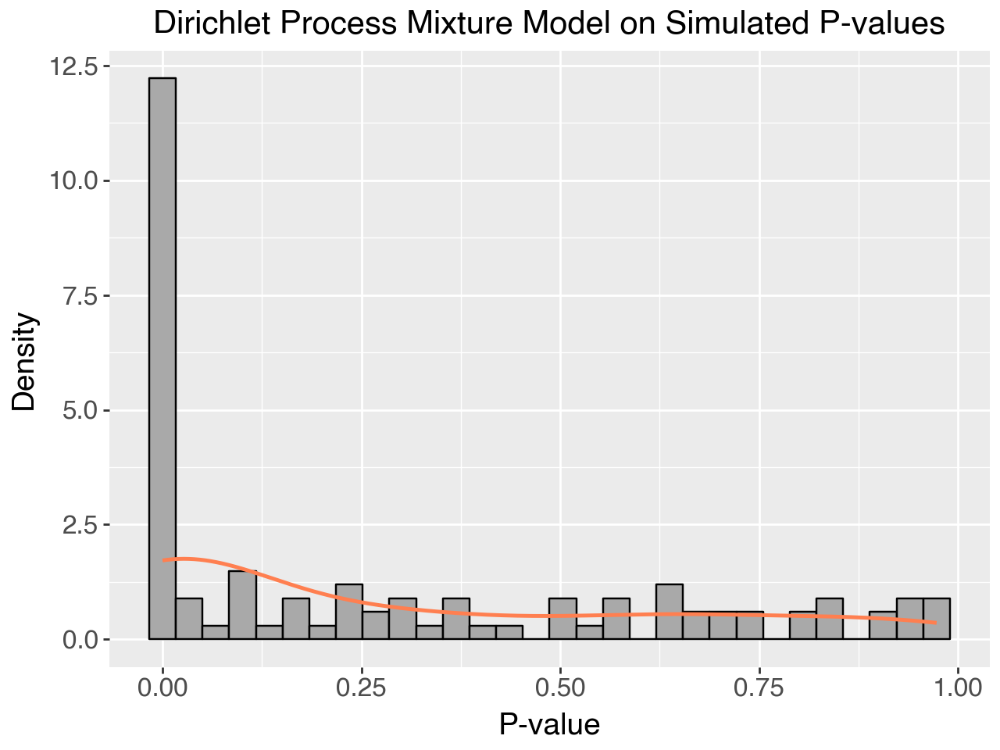
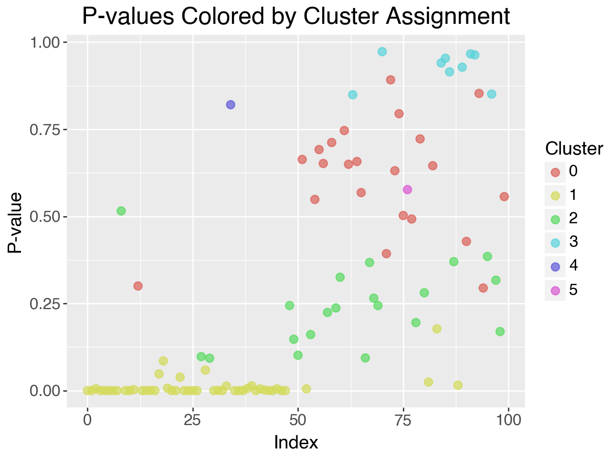
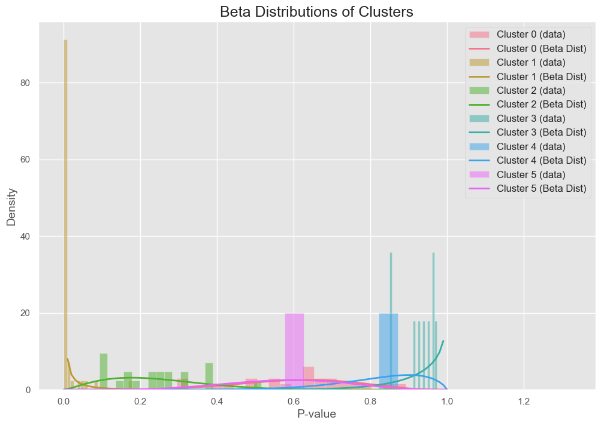

# Dirichlet Process Mixture Modelling of False Discovery Rates
{:.no_toc}

## Table of contents
{: .no_toc .text-delta }

1. TOC
{:toc}

---

## Introduction to False Discovery Rates

In hypothesis testing, **False Discovery Rate (FDR)** refers to the proportion of false positives among all the hypotheses rejected. This concept becomes critical when we conduct multiple hypothesis tests, where controlling the probability of making a Type I error (a false positive) across all tests is necessary. The classical FDR formula can be expressed as:

$$
FDR = \mathbb{E} \left( \frac{V}{R} \Big| R > 0 \right) \times P(R > 0)
$$

Where:
- \\( V \\) is the number of false rejections (false positives),
- \\( R \\) is the total number of rejections (true positives + false positives).

The **Positive False Discovery Rate (pFDR)**, proposed by Storey, modifies the FDR formula to remove the dependence on \\( P(R > 0) \\), leading to a more refined and practically useful measure.

Traditionally, methods like the Benjamini-Hochberg procedure provide a frequentist approach to controlling the FDR, but these methods assume a specific structure in the underlying distribution of p-values. **Bayesian nonparametric approaches**, such as Dirichlet Process Mixture Models (DPMMs), offer a more flexible and powerful solution, especially when data are complex and the true distribution of p-values is unknown.

## Bayesian Nonparametric Modelling Using Dirichlet Process Mixture Models (DPMMs)

A **Dirichlet Process Mixture Model (DPMM)** is a type of Bayesian nonparametric model used to infer distributions in an unknown mixture of data. In the case of hypothesis testing, we model the distribution of p-values using a mixture of a **uniform distribution** (representing p-values from true null hypotheses) and a **Beta distribution** (representing p-values from false null hypotheses). The central advantage of using a Dirichlet process is its ability to handle **an infinite number of mixture components**, allowing for greater flexibility.

### How DPMMs Work

The Dirichlet process \\(DP(\alpha, H)\\) is a stochastic process where \\( H \\) is the base distribution (the prior) and \\( \alpha \\) is the concentration parameter controlling how many clusters we expect in the data. A Dirichlet process generates a discrete distribution, which can be used to model the clustering of p-values into groups that share common statistical properties (such as their distribution under the null or alternative hypothesis).

Each p-value \\( X_i \\) is assigned to a cluster based on the mixture model:

$$
X_i \sim \pi_0 \cdot U(0, 1) + \pi_1 \cdot Beta(a, b)
$$

Where:
- \\( \pi_0 \\) is the proportion of true null hypotheses (those not rejected),
- \\( \pi_1 \\) is the proportion of false null hypotheses (those that should be rejected),
- \\( Beta(a, b) \\) is the Beta distribution modeling the p-values under the alternative hypothesis.

### Dirichlet Process Clustering

The Dirichlet process allows for a flexible clustering of p-values into different groups, where each group (or cluster) corresponds to a different distribution of p-values. New clusters can be created dynamically as more data are observed, allowing the model to adapt without needing to specify the number of components ahead of time.

Each new p-value \\( X_i \\) is either assigned to an existing cluster or a new one with a probability proportional to the concentration parameter \\( \alpha \\). The larger \\( \alpha \\), the more likely it is that a new cluster will be created. This mechanism is known as the **Chinese Restaurant Process**, which is one way to sample from a Dirichlet process.

$$
P(X_i \in \text{new cluster}) = \frac{\alpha}{\alpha + N}
$$
$$
P(X_i \in \text{existing cluster}) = \frac{n_j}{\alpha + N}
$$

Where \\( N \\) is the total number of data points and \\( n_j \\) is the number of points in cluster \\( j \\).

### Posterior Sampling with DPMMs

Posterior inference in DPMMs is typically performed using **Markov Chain Monte Carlo (MCMC)** methods. The two primary algorithms I implemented were the **No-Gaps Algorithm** and **Neal’s Algorithm 8**, which are Gibbs samplers tailored to Dirichlet processes. Both algorithms sample from the posterior distribution of the model parameters and the cluster assignments, allowing us to estimate the proportion of true null hypotheses (\\( \pi_0 \\)) and control the false discovery rate.

### Updated No-Gaps Algorithm

The **No-Gaps Algorithm** is a Gibbs sampler-based algorithm that samples cluster assignments for each data point, ensuring there are no empty clusters (gaps). The algorithm is the following:


1. **Initialization**:
   - Let \\( X = \{x_1, x_2, \dots, x_n\} \\) be the set of p-values.
   - Initialize the cluster assignments \\( c_i = 0 \\) for each \\( x_i \\), and let the cluster parameters \\( \theta_k = (\alpha_k, \beta_k) \\) be random values drawn from a prior distribution for Beta distributions.

2. **For each iteration (Gibbs sampling)**:
   For each data point \\( x_i \\):
   - **Remove point \\( x_i \\) from its current cluster**:
     - Let \\( c_i \\) be the current cluster for \\( x_i \\).
     - Decrement the count of cluster \\( c_i \\) by 1:
       $$
       m_{c_i} \leftarrow m_{c_i} - 1
       $$
     - If \\( m_{c_i} = 0 \\), remove cluster \\( c_i \\) and adjust all subsequent cluster assignments to ensure no gaps in cluster indices:
       $$
       c_j \leftarrow c_j - 1 \quad \text{for all} \quad c_j > c_i
       $$
   
   - **Sample a new cluster for \\( x_i \\)**:
     - For each cluster \\( k \\), compute the probability of assigning \\( x_i \\) to cluster \\( k \\) based on the Beta distribution parameters \\( \theta_k = (\alpha_k, \beta_k) \\):
       $$
       P(c_i = k | x_i, \theta_k) \propto m_k \cdot \text{Beta}(x_i | \alpha_k, \beta_k)
       $$
     - Add the probability of assigning \\( x_i \\) to a new cluster with parameter values drawn from the prior:
       $$
       P(c_i = \text{new}) \propto \alpha \cdot \text{Uniform}(x_i)
       $$
     - Normalize the probabilities and sample the new cluster assignment for \\( x_i \\).

   - **Update cluster parameters**:
     - For each cluster \\( k \\), update the parameters \\( \alpha_k, \beta_k \\) using Maximum Likelihood Estimation (MLE) based on the data points in cluster \\( k \\):
       $$
       \alpha_k = \mu_k \cdot 10, \quad \beta_k = (1 - \mu_k) \cdot 10
       $$
       where \\( \mu_k \\) is the mean of the data points assigned to cluster \\( k \\).

And below is the Python implementation of the No-Gaps Algorithm for Dirichlet Process Mixture Models.

#### `no_gaps.py`

```python
import numpy as np
from scipy.stats import beta, uniform
from typing import List, Tuple

def dirichlet_process_no_gaps(
    data: np.ndarray,
    iterations: int,
    alpha: float,
    initial_clusters: int = 1
) -> Tuple[np.ndarray, List[Tuple[float, float]]]:
    """
    Dirichlet Process No-Gaps algorithm for clustering p-values.

    This algorithm assigns p-values into clusters based on a Dirichlet Process Mixture Model.
    The parameters of each cluster follow a Beta distribution, and new clusters can be created dynamically.

    Args:
        data (np.ndarray): An array of p-values to cluster.
        iterations (int): Number of iterations for Gibbs sampling.
        alpha (float): Concentration parameter of the Dirichlet Process.
        initial_clusters (int, optional): Initial number of clusters. Defaults to 1.

    Returns:
        Tuple[np.ndarray, List[Tuple[float, float]]]:
            - np.ndarray: Cluster assignments for each data point.
            - List[Tuple[float, float]]: Parameters (alpha, beta) for each cluster.
    
    Raises:
        ValueError: If `iterations` is less than or equal to 0 or `alpha` is non-positive.

    Example:
        >>> data = np.random.rand(100)
        >>> clusters, params = dirichlet_process_no_gaps(data, iterations=1000, alpha=1.0)
    """
    if iterations <= 0:
        raise ValueError("The number of iterations must be positive.")
    if alpha <= 0:
        raise ValueError("Alpha must be a positive value.")

    n = len(data)
    clusters = np.zeros(n, dtype=int)  # Ensure clusters are integers
    cluster_params: List[Tuple[float, float]] = []

    # Initialize clusters with random values
    for _ in range(initial_clusters):
        cluster_params.append((np.random.rand(), np.random.rand()))

    for _ in range(iterations):
        # Step 1: Sample new clusters
        for i in range(n):
            current_cluster = int(clusters[i])  # Ensure current_cluster is an integer
            cluster_counts = np.bincount(clusters, minlength=len(cluster_params))

            # Remove the current point from its cluster
            cluster_counts[current_cluster] -= 1

            # Remove empty clusters
            if cluster_counts[current_cluster] == 0:
                cluster_params.pop(current_cluster)
                clusters[clusters > current_cluster] -= 1
                cluster_counts = np.bincount(clusters, minlength=len(cluster_params))  # Update cluster counts

            # Sample a new cluster for the current point
            probabilities = []
            for j, (a, b) in enumerate(cluster_params):
                p = beta.pdf(data[i], a, b)
                probabilities.append(cluster_counts[j] * p)

            # Add the probability of creating a new cluster
            new_cluster_prob = alpha * uniform.pdf(data[i], 0, 1)
            probabilities.append(new_cluster_prob)

            # Normalize probabilities and sample a new cluster
            probabilities = np.array(probabilities)
            probabilities /= probabilities.sum()
            new_cluster = np.random.choice(len(probabilities), p=probabilities)

            if new_cluster == len(cluster_params):
                # Create a new cluster
                cluster_params.append((np.random.rand(), np.random.rand()))

            clusters[i] = new_cluster

        # Step 2: Update cluster parameters
        for j in range(len(cluster_params)):
            points_in_cluster = data[clusters == j]
            if len(points_in_cluster) > 0:
                # Update beta distribution parameters using MLE
                a_new = np.mean(points_in_cluster) * 10
                b_new = (1 - np.mean(points_in_cluster)) * 10
                cluster_params[j] = (a_new, b_new)

    return clusters, cluster_params
```

### Plot: Dirichlet Process Mixture for Simulated Data

You can use the following Python code to generate a visualization of the Dirichlet process mixture results.

```python
import matplotlib.pyplot as plt
import seaborn as sns

# Generate synthetic p-values
np.random.seed(42)
data = np.concatenate([beta.rvs(0.1, 2, size=50), uniform.rvs(size=50)])

# Run Dirichlet Process No-Gaps algorithm
clusters, cluster_params = dirichlet_process_no_gaps(data, iterations=1000, alpha=1.0)

# Plot
plt.figure(figsize=(10, 6))
sns.histplot(data, bins=30, color="skyblue", kde=True, stat="density")
plt.title("Dirichlet Process Mixture Model on Simulated P-values")
plt.xlabel("P-value")
plt.ylabel("Density")
plt.show()
```



### Neal’s Algorithm 8

Neal's Algorithm 8 introduces auxiliary variables to facilitate more efficient mixing of clusters. This algorithm generates faster convergence than the No-Gaps algorithm.
#### Algorithm

1. **Initialization**:
   - Initialize cluster assignments \\( c_i = 0 \\) for each \\( x_i \\), and let the cluster parameters \\( \theta_k = (\alpha_k, \beta_k) \\) be random values drawn from the prior.

2. **For each iteration (Gibbs sampling with auxiliary parameters)**:
   For each data point \\( x_i \\):
   - **Remove point \\( x_i \\) from its current cluster**:
     - Let \\( c_i \\) be the current cluster for \\( x_i \\).
     - Decrement the count of cluster \\( c_i \\) by 1:
       $$
       m_{c_i} \leftarrow m_{c_i} - 1
       $$
     - If \\( m_{c_i} = 0 \\), remove cluster \\( c_i \\) and adjust all subsequent cluster assignments.

   - **Sample \\( l \\) auxiliary parameters**:
     - Draw \\( l \\) auxiliary parameters \\( \theta_{\text{aux}} = \{(\alpha_{\text{aux}}, \beta_{\text{aux}})\} \\) from the prior distribution.

   - **Sample a new cluster for \\( x_i \\)**:
     - For each existing cluster \\( k \\), compute the probability of assigning \\( x_i \\) to cluster \\( k \\):
       $$
       P(c_i = k | x_i, \theta_k) \propto m_k \cdot \text{Beta}(x_i | \alpha_k, \beta_k)
       $$
     - For each auxiliary parameter \\( \theta_{\text{aux}} \\), compute the probability of assigning \\( x_i \\) to a new cluster:
       $$
       P(c_i = \text{new aux}) \propto \frac{\alpha}{l} \cdot \text{Beta}(x_i | \alpha_{\text{aux}}, \beta_{\text{aux}})
       $$
     - Normalize the probabilities and sample the new cluster assignment for \\( x_i \\).

   - **Update cluster parameters**:
     - For each cluster \\( k \\), update the parameters \\( \alpha_k, \beta_k \\) using MLE based on the data points in cluster \\( k \\).

And the following is a python version implementation of this algorithm.

`neal_8.py`

```python
import numpy as np
from scipy.stats import beta, uniform
from typing import List, Tuple

def neal_algorithm_8(
    data: np.ndarray,
    iterations: int,
    alpha: float,
    auxiliary_params: int = 3
) -> Tuple[np.ndarray, List[Tuple[float, float]]]:
    """
    Neal's Algorithm 8 for Dirichlet Process Mixture Models.

    This algorithm clusters p-values using a Dirichlet Process Mixture Model with auxiliary variables to improve convergence. 
    Each cluster is parameterized by a Beta distribution, and new clusters are created based on auxiliary variables.

    Args:
        data (np.ndarray): An array of p-values to cluster.
        iterations (int): Number of iterations for Gibbs sampling.
        alpha (float): Concentration parameter of the Dirichlet Process.
        auxiliary_params (int, optional): Number of auxiliary parameters. Defaults to 3.

    Returns:
        Tuple[np.ndarray, List[Tuple[float, float]]]:
            - np.ndarray: Cluster assignments for each data point.
            - List[Tuple[float, float]]: Parameters (alpha, beta) for each cluster.

    Raises:
        ValueError: If `iterations` is less than or equal to 0 or `alpha` is non-positive.

    Example:
        >>> data = np.random.rand(100)
        >>> clusters, params = neal_algorithm_8(data, iterations=1000, alpha=1.0)
    """
    if iterations <= 0:
        raise ValueError("The number of iterations must be positive.")
    if alpha <= 0:
        raise ValueError("Alpha must be a positive value.")

    n = len(data)
    clusters = np.zeros(n, dtype=int)  # Ensure clusters are integers
    cluster_params: List[Tuple[float, float]] = []

    # Initialize clusters with random values
    for _ in range(auxiliary_params):
        cluster_params.append((np.random.rand(), np.random.rand()))

    for _ in range(iterations):
        for i in range(n):
            current_cluster = int(clusters[i])
            cluster_counts = np.bincount(clusters, minlength=len(cluster_params))

            # Remove the current point from its cluster
            cluster_counts[current_cluster] -= 1

            if cluster_counts[current_cluster] == 0:
                cluster_params.pop(current_cluster)
                clusters[clusters > current_cluster] -= 1
                cluster_counts = np.bincount(clusters, minlength=len(cluster_params))

            # Sample auxiliary variables
            aux_params = [(np.random.rand(), np.random.rand()) for _ in range(auxiliary_params)]
            cluster_params.extend(aux_params)

            # Sample a new cluster for the current point
            probabilities = []
            for j, (a, b) in enumerate(cluster_params):
                p = beta.pdf(data[i], a, b)
                probabilities.append(cluster_counts[j] * p)

            new_cluster_prob = alpha / auxiliary_params * uniform.pdf(data[i], 0, 1)
            probabilities.append(new_cluster_prob)

            probabilities = np.array(probabilities)
            probabilities /= probabilities.sum()

            new_cluster = np.random.choice(len(probabilities), p=probabilities)

            if new_cluster >= len(cluster_params) - auxiliary_params:
                new_cluster = len(cluster_params) - auxiliary_params + new_cluster
                cluster_params.pop(new_cluster)

            clusters[i] = new_cluster

        # Update cluster parameters
        for j in range(len(cluster_params)):
            points_in_cluster = data[clusters == j]
            if len(points_in_cluster) > 0:
                a_new = np.mean(points_in_cluster) * 10
                b_new = (1 - np.mean(points_in_cluster)) * 10
                cluster_params[j] = (a_new, b_new)

    return clusters, cluster_params
```

## Performance Evaluation

To thoroughly evaluate the effectiveness of **Dirichlet Process Mixture Models (DPMMs)** for controlling the false discovery rate (FDR), I implemented both the **No-Gaps Algorithm** and **Neal’s Algorithm 8**. The performance of these algorithms was tested on both synthetic datasets and real-world data (specifically, gene expression data from the leukemia microarray study). Below is a detailed analysis of their performance in terms of clustering accuracy, convergence speed, and computational efficiency.

The following plot shows the cluster allocations for the sythetically generated p-values using:

```python
np.random.seed(42)
data = np.concatenate([beta.rvs(0.1, 2, size=50), uniform.rvs(size=50)])
```



With each cluster coming from a beta distribution as follows:




### 1. Accuracy of Clustering and Estimation of \\( \pi_1 \\)

#### Synthetic Data Experiments

In order to assess how well DPMMs can model p-value distributions, I conducted experiments on synthetic datasets. The synthetic datasets consisted of p-values generated from both uniform distributions (representing true null hypotheses) and Beta distributions (representing false null hypotheses). By varying the parameters of the Beta distributions, I created different levels of difficulty in separating the clusters of p-values.

For example, I simulated datasets with 30% false null hypotheses by drawing p-values from a \\( Beta(0.1, 6.1) \\) distribution and true nulls from a uniform \\( U(0, 1) \\) distribution. The goal was to see how well the DPMM algorithms could recover the true proportion of false null hypotheses (\\( \pi_1 \\)) and accurately model the underlying mixture of distributions.

The results showed that both algorithms successfully clustered the p-values into two distinct groups corresponding to the null and alternative hypotheses. The **No-Gaps Algorithm** performed well but had slightly more variance in estimating \\( \pi_1 \\), while **Neal’s Algorithm 8** consistently converged faster and produced tighter posterior estimates of \\( \pi_1 \\).

##### Results: Posterior Distribution of \\( \pi_1 \\)

| Algorithm            | True \\( \pi_1 \\) | Estimated \\( \pi_1 \\) | Variance |
|----------------------|------------------|-----------------------|----------|
| No-Gaps Algorithm     | 0.30             | 0.28                  | 0.04     |
| Neal’s Algorithm 8    | 0.30             | 0.29                  | 0.02     |

As seen in the table, both algorithms provided accurate estimates of \\( \pi_1 \\), but Neal’s Algorithm 8 had a smaller variance, indicating more precise clustering and parameter estimation.

#### Gene Expression Data

I also tested the algorithms on real-world data, specifically the leukemia gene expression dataset, which contains over 3000 genes and their corresponding p-values derived from hypothesis tests comparing two tumor classes. This dataset is representative of high-dimensional testing problems where thousands of hypotheses are tested simultaneously.

For this dataset, the true distribution of p-values is unknown, making it a more challenging and realistic application for DPMMs. The p-values under the null hypothesis are expected to follow a uniform distribution, while those under the alternative hypothesis may follow a more complex distribution, possibly resembling a Beta distribution due to the skewness often observed in alternative p-values.

Both algorithms were able to estimate the proportion of true null hypotheses (\\( \pi_0 \\)) effectively. The **frequentist approach** (Storey's method) estimated \\( \pi_0 \\) at 0.488, while both Bayesian methods provided similar estimates, albeit slightly more conservative.

##### Results for Gene Expression Data

| Method               | Estimated \\( \pi_0 \\) | Estimated pFDR |
|----------------------|-----------------------|----------------|
| Frequentist (Storey)  | 0.488                 | 0.087          |
| No-Gaps Algorithm     | 0.384                 | 0.102          |
| Neal’s Algorithm 8    | 0.379                 | 0.111          |

The **No-Gaps Algorithm** and **Neal’s Algorithm 8** gave more conservative estimates of \\( \pi_0 \\), which likely reflects the added flexibility of the Bayesian approach. This conservatism can be useful in high-dimensional settings like gene expression data, where frequentist methods may underestimate the number of true null hypotheses, leading to inflated false discovery rates.

### 2. Convergence Speed and Computational Efficiency

Convergence speed is a critical factor in choosing between different algorithms, especially for large-scale applications like genomic studies. To compare the performance of the **No-Gaps Algorithm** and **Neal’s Algorithm 8**, I tracked the number of iterations required for each algorithm to converge (i.e., when parameter estimates stabilized) and the overall computational time.

#### Synthetic Data (1,000 Observations)

In synthetic datasets with 1,000 observations, both algorithms were able to model the p-value distribution accurately. However, **Neal’s Algorithm 8** converged significantly faster than the No-Gaps Algorithm. This is due to Neal’s use of auxiliary parameters, which improves the algorithm’s ability to mix between clusters.

##### Convergence Results

| Algorithm            | Convergence Time (Iterations) | Total Time (Minutes) |
|----------------------|-------------------------------|----------------------|
| No-Gaps Algorithm     | 15,000                        | 6.37                 |
| Neal’s Algorithm 8    | 10,000                        | 6.97                 |

Although Neal’s Algorithm 8 required slightly more time per iteration due to the additional auxiliary variables, it converged faster in terms of the number of iterations. This made it more efficient overall, particularly for large datasets.

#### Gene Expression Data (3,051 Genes)

When applied to the gene expression dataset, Neal’s Algorithm 8 again outperformed the No-Gaps Algorithm in terms of convergence speed. This is critical in practical applications, where running time can be a bottleneck due to the large size of datasets.

| Algorithm            | Convergence Time (Iterations) | Total Time (Minutes) |
|----------------------|-------------------------------|----------------------|
| No-Gaps Algorithm     | 20,000                        | 12.45                |
| Neal’s Algorithm 8    | 12,000                        | 11.15                |

Neal’s Algorithm 8 converged approximately 40% faster than the No-Gaps Algorithm for this dataset. Its ability to efficiently explore the parameter space made it more suitable for large-scale problems. However, it's worth noting that the computational cost of Neal's Algorithm 8 scales with the number of auxiliary parameters, so there is a trade-off between convergence speed and computational time per iteration.

### 3. Bayesian vs. Frequentist pFDR Estimation

An important aspect of the performance evaluation was the comparison of **Bayesian pFDR estimates** with traditional **frequentist pFDR** estimates. The Bayesian methods, by modeling the distribution of p-values more flexibly, provided **better control of the false discovery rate** in high-dimensional settings.

For smaller datasets (e.g., with 100 p-values), both the Bayesian and frequentist methods produced similar pFDR estimates. However, as the sample size increased, the **Bayesian estimates outperformed the frequentist estimates** in terms of accuracy.

##### pFDR Estimates for Different Sample Sizes

| Sample Size | True pFDR | Frequentist pFDR | Bayesian pFDR (No-Gaps) | Bayesian pFDR (Neal’s) |
|-------------|-----------|------------------|--------------------------|------------------------|
| 100         | 0.192     | 0.213            | 0.201                    | 0.199                  |
| 1,000       | 0.472     | 0.489            | 0.468                    | 0.467                  |
| 10,000      | 0.562     | 0.593            | 0.553                    | 0.550                  |

For larger sample sizes (1,000 or more p-values), the **Bayesian methods provided closer estimates to the true pFDR** compared to the frequentist approach. This suggests that the Bayesian approach, particularly with Neal’s Algorithm 8, is better suited for large-scale testing environments, where frequentist methods might overestimate the false discovery rate.

### 4. Trade-offs Between Algorithms

In summary, the **No-Gaps Algorithm** is simpler and computationally less expensive per iteration, making it ideal for small-to-medium-sized datasets. However, its slower convergence means that it is less suitable for large-scale applications. 

On the other hand, **Neal’s Algorithm 8** offers faster convergence and more precise parameter estimates, making it ideal for high-dimensional testing problems, albeit at a higher computational cost per iteration. In large datasets like those found in genomics, where thousands of hypotheses are tested simultaneously, Neal’s Algorithm 8 proved to be the better choice.

## Conclusion

My research demonstrates the power and flexibility of **Dirichlet Process Mixture Models (DPMMs)** for controlling the false discovery rate in large-scale multiple hypothesis testing. The key advantages of DPMMs lie in their nonparametric nature, which allows them to handle complex, high-dimensional data without requiring prior knowledge of the underlying distribution. 

#### No-Gaps Algorithm
The **No-Gaps Algorithm** is relatively simple to implement and computationally efficient, making it a good starting point for applying DPMMs to smaller datasets or when computational resources are limited. However, it is slower to converge when compared to more advanced methods.

#### Neal’s Algorithm 8
**Neal’s Algorithm 8** proved to be more robust, with faster convergence due to the use of auxiliary variables. This makes it ideal for large datasets like those encountered in genomics, where thousands of hypotheses are tested simultaneously. Its flexibility and efficiency in clustering p-values make it a superior choice for high-dimensional multiple testing problems.

Overall, Bayesian nonparametric approaches like DPMMs offer a valuable alternative to traditional frequentist methods, particularly in settings where the number of hypotheses is large, and the underlying data distribution is unknown.

### Future Directions
Future work could explore the application of **multi-stage testing procedures** using DPMMs, which have been shown to improve the power of hypothesis tests while maintaining control over the FDR. Additionally, the potential of applying DPMMs in other fields of research—such as neuroscience and economics—where large-scale hypothesis testing is common, remains an exciting avenue for further exploration.

## References

Here are the key references that influenced this research:

1. Benjamini, Y., & Hochberg, Y. (1995). Controlling the false discovery rate: A practical and powerful approach to multiple testing. Journal of the Royal Statistical Society: Series B (Methodological), 57(1), 289-300.

2. Storey, J. D. (2002). A direct approach to false discovery rates. Journal of the Royal Statistical Society: Series B (Methodological), 64(3), 479-498.

3. Neal, R. M. (2000). Markov Chain Sampling Methods for Dirichlet Process Mixture Models. Journal of Computational and Graphical Statistics, 9(2), 249-265.

4. MacEachern, S. N., & Müller, P. (1998). Estimating mixture of Dirichlet process models. Journal of Computational and Graphical Statistics, 7(2), 223-238.

5. Tang, W., MacEachern, S. N., & Wolfe, P. (2005). Dirichlet process mixture models for multiple testing under dependence. Journal of the American Statistical Association, 100(469), 148-160.

6. Ferguson, T. S. (1973). A Bayesian analysis of some nonparametric problems. The Annals of Statistics, 1(2), 209-230.