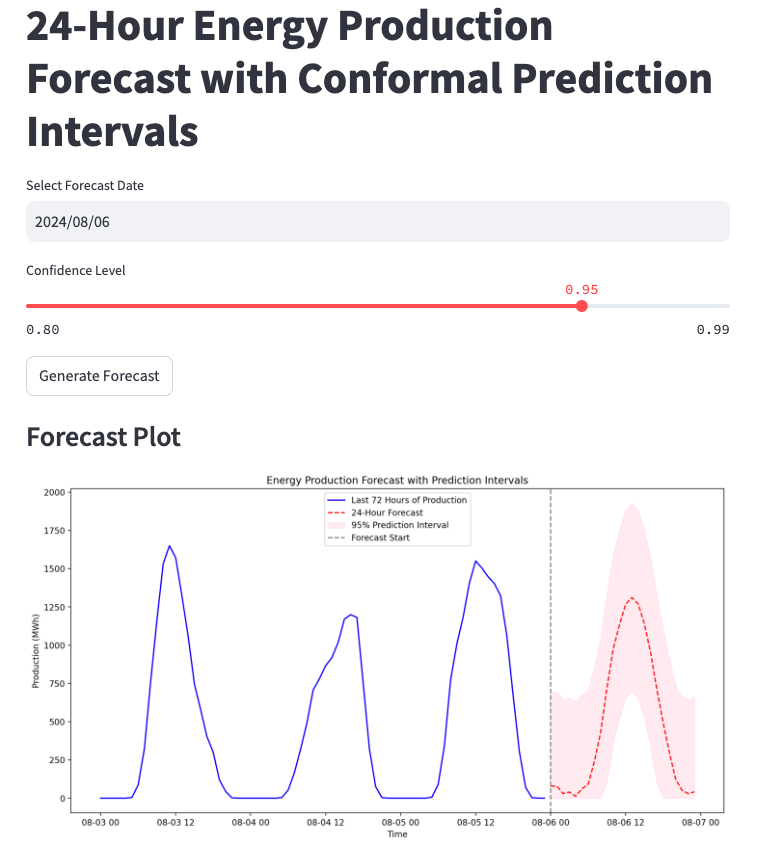

# Building an Energy Forecasting Dashboard with LSTM and Conformal Prediction Intervals
{:.no_toc}

## Table of contents
{: .no_toc .text-delta }

1. TOC
{:toc}

---


In the world of renewable energy, accurately forecasting power production is vital for balancing supply with demand. Solar energy, for example, can vary significantly based on weather and time of day, making it inherently challenging to predict. To address this, we built a predictive dashboard using **Long Short-Term Memory (LSTM)** neural networks and **conformal prediction intervals** to forecast solar energy production with quantifiable uncertainty. This interactive dashboard is developed in **Streamlit**, allowing users to generate and view forecasts along with prediction intervals.

In this post, we’ll walk through the structure of the project, discuss the methods we used, and show how we implemented it all into a Streamlit app for interactive visualization.

---

### Project Overview
The goal of this project was to:
1. **Predict the next 24 hours of solar energy production** using recent historical data.
2. **Provide a confidence interval around each prediction** to help quantify the uncertainty, enabling more informed energy management.
3. **Develop a dashboard** to visualize forecasts and interactively adjust parameters like confidence level.

Our solution integrates three main components:
- **LSTM model**: A deep learning model tailored for time series data, used here to forecast energy production.
- **Conformal prediction intervals**: A non-parametric method to calculate uncertainty bounds based on historical residuals, providing a flexible way to add uncertainty without complex assumptions.
- **Streamlit dashboard**: An easy-to-use web interface for generating and viewing forecasts.

---

### 1. How Conformal Predictions Work

Conformal prediction is a method used to create prediction intervals that are statistically valid, even for complex machine learning models. Unlike traditional methods that often assume a specific distribution of residuals, conformal prediction is **distribution-free** and based on a calibration process that provides uncertainty intervals.

#### Steps in Conformal Prediction

1. **Calibration with Residuals**: 
   Let’s assume we have a trained model, \\( f \\), that predicts energy production based on recent data. We take a **calibration set** of historical data, which wasn’t used during training, and calculate residuals between predictions and actual values:
   
   $$
   \text{residual}_i = |y_i - f(x_i)|
   $$
   
   where \\( y_i \\) is the actual production and \\( f(x_i) \\) is the model’s forecast at time \\( i \\). These residuals give us a measure of how much error we typically see in predictions.

2. **Quantile Calculation for Prediction Interval**: 
   To form a prediction interval at a given confidence level \\( 1 - \alpha \\), we calculate quantiles of the residuals. For example, if we want a 95% confidence interval, we use the 97.5th quantile for the upper bound:
   
   $$
   q_{\text{upper}} = \text{Quantile}(\{\text{residual}_i\}, 1 - \alpha / 2)
   $$
   
   This quantile \\( q_{\text{upper}} \\) tells us the error threshold such that 95% of future residuals are expected to fall below this threshold.

3. **Applying Prediction Intervals**:
   For each new forecasted value \\( \hat{y}_{t+1} = f(x_{t+1}) \\), we construct the prediction interval as:
   
   $$
   \left[ \hat{y}_{t+1} - q_{\text{upper}}, \hat{y}_{t+1} + q_{\text{upper}} \right]
   $$
   
   In practice, if the forecasted value minus the error quantile is negative (which could happen with production data that can’t be negative), we clip it to zero.

#### Why Conformal Prediction Works
Conformal prediction intervals are **guaranteed to cover the true value \\( y_{t+1} \\)** with probability \\( 1 - \alpha \\) under mild assumptions, thanks to its use of historical residuals rather than parametric assumptions. This method is particularly valuable in non-linear models like LSTMs, where residuals may not follow a normal distribution.

---

### 2. How LSTM Models Work for Time Series Forecasting

**Long Short-Term Memory (LSTM)** networks are a type of Recurrent Neural Network (RNN) designed to capture long-term dependencies in sequential data. Traditional RNNs struggle with long sequences due to issues like vanishing gradients, but LSTMs overcome this by using a complex architecture with **gates** that control information flow.

#### LSTM Architecture

An LSTM cell consists of:
1. **Cell State (\\( c_t \\))**: The memory of the cell, which carries information across time steps.
2. **Hidden State (\\( h_t \\))**: The output of the cell at each time step, which serves as input to the next cell in the sequence.

The flow of data in an LSTM cell is controlled by three types of gates:

1. **Forget Gate** (\\( f_t \\)):
   Controls how much of the previous cell state (\\( c_{t-1} \\)) should be retained:
   $$
   f_t = \sigma(W_f \cdot [h_{t-1}, x_t] + b_f)
   $$
   where \\( \sigma \\) is the sigmoid function, \\( W_f \\) are weights, and \\( x_t \\) is the input at time \\( t \\).

2. **Input Gate** (\\( i_t \\)) and Candidate Cell State (\\( \tilde{c}_t \\)):
   Determines how much new information should be added to the cell state:
   $$
   i_t = \sigma(W_i \cdot [h_{t-1}, x_t] + b_i)
   $$
   $$
   \tilde{c}_t = \tanh(W_c \cdot [h_{t-1}, x_t] + b_c)
   $$
   
   Here, \\( i_t \\) decides the amount of information to add, and \\( \tilde{c}_t \\) is the new candidate value.

3. **Update Cell State** (\\( c_t \\)):
   Combines the forget and input gates to update the cell state:
   $$
   c_t = f_t \cdot c_{t-1} + i_t \cdot \tilde{c}_t
   $$

4. **Output Gate** (\\( o_t \\)):
   Controls what part of the cell state to output as the hidden state:
   $$
   o_t = \sigma(W_o \cdot [h_{t-1}, x_t] + b_o)
   $$
   $$
   h_t = o_t \cdot \tanh(c_t)
   $$

#### Using LSTM for Forecasting

In time series forecasting, an LSTM model is trained on sequences of past data (e.g., the last 72 hours) to predict future values (e.g., the next 24 hours). The LSTM effectively learns temporal patterns in the data, such as daily production cycles, allowing it to generalize these patterns for future forecasts.

Given a trained LSTM model \\( f \\), we can use it to forecast:
$$
\hat{y}_{t+1}, \hat{y}_{t+2}, \ldots, \hat{y}_{t+24} = f(x_t)
$$
where \\( x_t \\) represents the sequence of inputs (historical production values) up to time \\( t \\).

The LSTM’s ability to retain information over long sequences makes it well-suited for energy production forecasting, where past data contains important cyclical patterns driven by time of day, weather, and other factors.

---

### 3. Visualizing Forecasts with Streamlit



With the forecasting model and uncertainty intervals in place, we needed an interactive way to display results. **Streamlit** was the perfect choice: it’s a Python framework designed for building data apps quickly and intuitively. Here’s how we structured our Streamlit app:

#### App Features
1. **Date Selection**: Users can select a forecast date, and the app will retrieve the necessary historical data.
2. **Confidence Level Slider**: Users can set the desired confidence level for the prediction intervals (e.g., 95%), giving control over the degree of uncertainty shown in the forecast.
3. **Forecast Generation**: When the user clicks “Generate Forecast,” the app:
   - Fetches the most recent 72 hours of data for model input,
   - Uses the LSTM model to predict the next 24 hours,
   - Computes conformal prediction intervals to show upper and lower bounds.
4. **Visualization**: The app plots the last 72 hours of historical production data, the 24-hour forecast, and shaded areas representing the prediction intervals. A dashed vertical line indicates where historical data ends and the forecast begins.

#### Code Example: Generating the Forecast in Streamlit
Here’s a simplified snippet showing the key steps in generating the forecast and displaying it in Streamlit:

```python
# Select forecast date and confidence level in Streamlit
forecast_date = st.date_input("Select Forecast Date", datetime.date.today())
confidence_level = st.slider("Confidence Level", 0.80, 0.99, 0.95)

if st.button("Generate Forecast"):
    with st.spinner("Generating forecast..."):
        # Fetch calibration data and calculate residuals
        calibration_data = get_calibration_data()
        residuals = calculate_residuals_for_conformal(model, calibration_data)

        # Generate forecast with conformal intervals
        forecast_df, historical_data = make_conformal_forecast(model, forecast_date, residuals, alpha=1-confidence_level)

        # Plotting
        fig, ax = plt.subplots(figsize=(14, 7))
        ax.plot(historical_data.index[-72:], historical_data['Production_MWh'][-72:], label='Last 72 Hours')
        ax.plot(forecast_df.index, forecast_df['Forecasted_Production_MWh'], label='Forecast', color='red', linestyle='--')
        ax.fill_between(forecast_df.index, forecast_df['Lower_Bound'], forecast_df['Upper_Bound'], color='pink', alpha=0.3, label=f'{int(confidence_level * 100)}% Prediction Interval')
        ax.axvline(x=forecast_df.index[0], color='gray', linestyle='--', label='Forecast Start')
        ax.legend()
        st.pyplot(fig)
```

---

### 4. Results and Insights
Our app provides an intuitive interface for exploring 24-hour energy production forecasts with confidence intervals. Users can adjust the confidence level to see how the prediction interval widens or narrows, directly illustrating the trade-off between certainty and interval width. This is especially useful for energy managers who need reliable production forecasts to plan resources and maintain grid stability.

### 5. Key Takeaways
1. **LSTM Models for Time Series**: LSTMs are effective at capturing patterns in sequential data, making them ideal for time series forecasting tasks like energy production.
2. **Conformal Prediction for Uncertainty Quantification**: Conformal prediction intervals are a practical way to add uncertainty to forecasts, providing an interpretable range around each prediction.
3. **Streamlit for Data Apps**: Streamlit’s ease of use and flexibility make it an excellent choice for quickly deploying interactive data applications.

---

### 6. Future Directions
We plan to extend this dashboard with:
- **Additional Forecast Horizons**: Allowing users to select different forecast horizons (e.g., 6, 12, 48 hours).
- **Incorporating Weather Data**: Adding weather forecasts to the model input to improve prediction accuracy.
- **Further Model Optimization**: Experimenting with more complex architectures, such as stacked LSTMs or transformers, to enhance forecast precision.

This project demonstrates how LSTMs and conformal prediction intervals can be combined to build a powerful, interpretable forecasting tool, with Streamlit enabling straightforward deployment for end-users. Whether you’re an energy manager or a data scientist, this framework provides a reliable, scalable way to explore and visualize future energy production with uncertainty bounds.